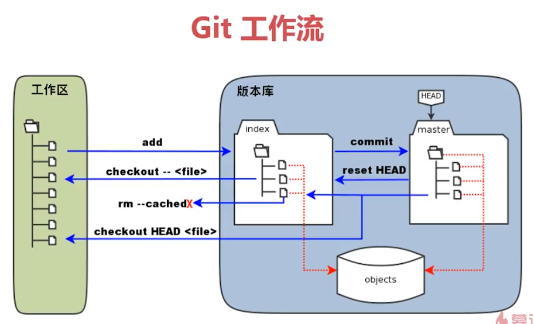
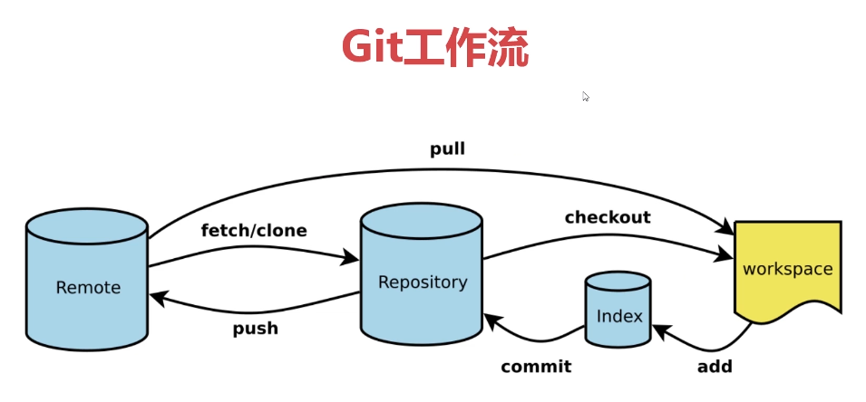

#  Command-line with Git Bash

1. Git基本配置
2. Git基本工作流
3. 标签管理，分支管理


### 基本命令行指令

+ pwd 显示当前目录

+ ll  展示当前目录下所有文件数目和时间信息

+ ls  列出所有目录

+ ls -a  展示所有目录，包括隐藏的目录

+ mkdir file 创建file文件夹

+ cd .. 返回上一级目录

+ clear  清除当前工作目录

+ cd ~ 回到根目录

  

### 全局配置

+ 命令行

  ```
  git config --global user.name "CodingFlying"
  git config --global user.email "pengjing0902@163.com"
  git config --list   //查看配置是否成功
  ```


### 新建本地版本库

+ 命令行

  ```
  git init    //初始化版本库
  ls -a      
  echo "# Data Structure & Algorithm" >> README.md //新建文件README并追加内容
  ll
  cat README.md       //展示当前文件的内容
  git add README.md     // 添加到暂存区，临时开发记录信息
  git commit -m "Inital commit"   //提交到本地仓库，会有commit信息，需要慎重考虑
  git status      //查看仓库状态
  ```

  


### Git 工作流

+ 命令行

  ```
  git init    //初始化版本库    
  echo "add content 1" >> test.txt
  git add text.txt     // 添加到暂存区index区，临时开发记录信息
  git commit -m "first commit"   //提交到本地仓库Repository区，会有commit信息，需要慎重考虑
  git status      //查看仓库状态
  
  echo "add content 2" >> test.txt
  git add test.txt         // 添加到暂存区，临时开发记录信息，没有commit
  git reset HEAD test.txt  //将暂存区的修改回归到工作区
  git status
  git checkout -- test.txt  // 将本地工作区文件clean，"add content"内容消失
  git status
  
  echo "add content 3" >> test.txt
  git add test.txt          //添加到暂存区，临时开发记录信息
  git commit -m "second commit
  git log    //查看commit号
  git reset --hard bc136a241ca350cb3962f8d17c1e9d160c288867  //回滚到第一次提交
  git status
  
  git rm test.txt   //清空了本地工作区文件，暂存区和本地仓库没有清空
  git status
  git commit -m "delete test.txt"`
  git status
  
  git pull  //从远程仓库将文件拉取到本地工作区
  
  ```






### 创建SSH key

+ 命令行

  ```
  ssh-keygen -t rsa -C "pengjing0902@163.com"
  cd ~
  pwd
  cd .ssh
  ll
  cat id_rsa.pub
  ssh -T git@github.com   //查看本地和Github是否连通
  ```

  


###  远程仓库

+ 第一步进入网站 https://github.com 创建新的仓库

  ```
  git remote add origin https://github.com/CodingFlying/Data-Structure-and-Algorithm.git
  git push -u origin master  //origin指远程的意思，-u本地的master和远程的master绑定
  ```

  

+ 对README文件进行修改

  ```
  git add README.md
  git commit -m "the second commit"
  git push    //接下来提交，可以直接git push，不需要 -u origin master
  ```


### 克隆厂库

+ 克隆远程仓库

  ```
  git clone 'https://github.com/CodingFlying/Git-Learning.git'
  ```

+ 本地修改文件并提交远程仓库

  ```
  cd Git-Learning
  git add Guide.md  
  git add GitFlow.PNG
  git commit -m 'Inital commit'
  git push  //不需要git push -u origin master，克隆下来文件，本地仓库与远程仓库已经绑定
  ```
  
  

### 标签管理

+ 确定本地仓库已经与远程仓库绑定

  ```
  git tag`             //查看所有标签
  git tag V1.0.1    //根据当前的版本id，创建标签
  git push origin V1.0.1    //标签发布
  
  git tag -a V2.0.1 -m 'comment'    //打标签，并指定提交信息
  
  git tag -d V2.0.1        //删除标签
  ```


### 分支管理

+ 示意图

  

+ 本地建立仓库

  ```
  git branch feature_x   //新建分支
  git branch             //查看分支，*号表示当前在哪一个分支操作
  git checkout feature_x   //切换到feature_x分支操作
  
  git checkout master
  git merge feature_x     //切换到master分支并合并featur_x分支上
  git branch -d feature_x   //删除分支
  ```
